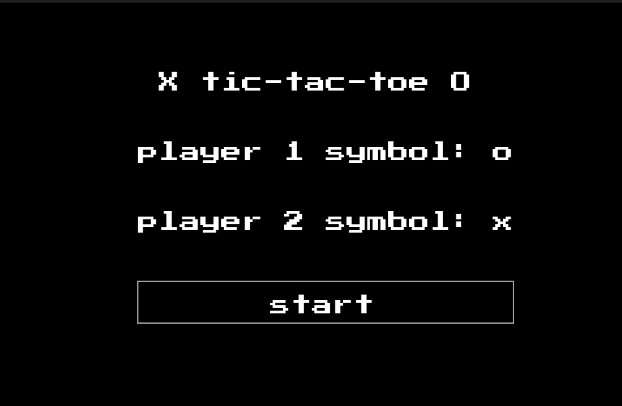
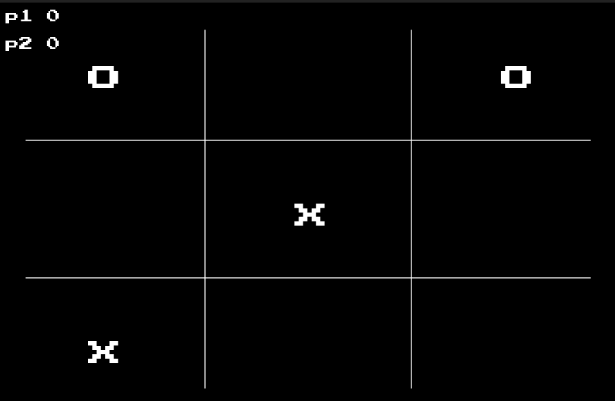
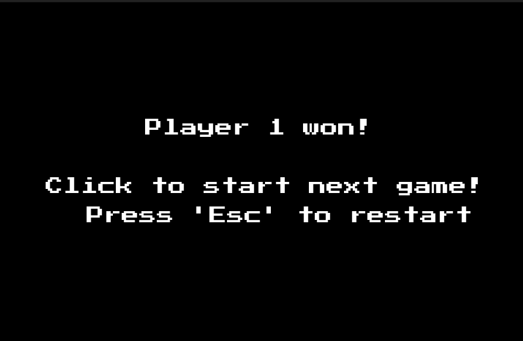

# TicTacToe

A simple version of TicTacToe made in lua and Love2d

## How to play

First, select the player 1 and player 2 symbols at the start screen, then click start.
Each time one local player clicks on a spot and then you need to pass your mouse to your local friend :)
The game ends when a tie is reached or when someone wins.
